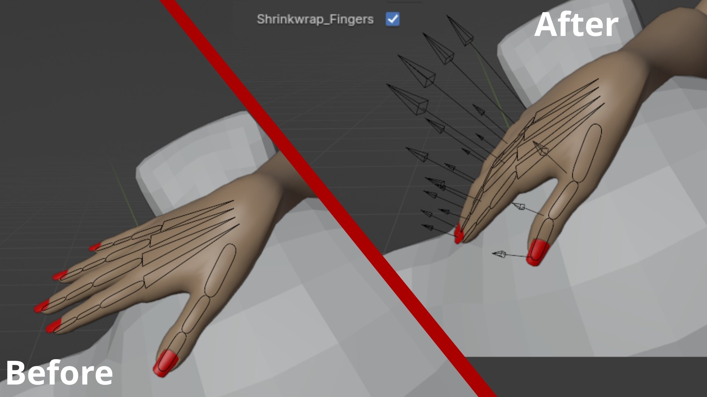
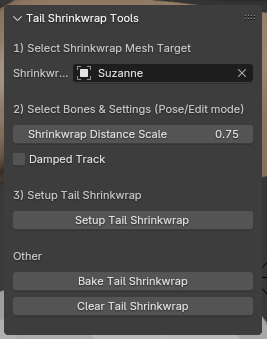
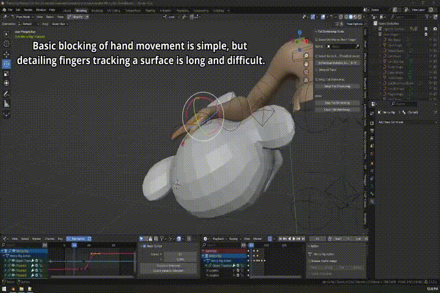
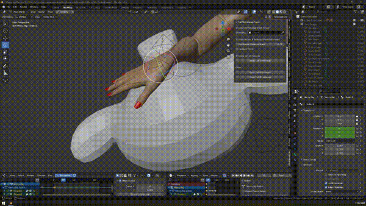

# Tail-Based Shrinkwrap for Bones

A Blender add-on for creating non-destructive, tail-based shrinkwrap setups for bones, using constrained empties as IK proxies. This workflow is useful for rigging scenarios where you want your bone tails to follow a surface precisely. 

## Table of Contents
- [Features](#features)
- [Compatibility](#compatibility)
- [Installation](#installation)
- [Usage](#usage)
- [License](#license)

## Features
- **Adjustable default distance**: Scale the default distance of the shrinkwraps up or down. This is relative to the bone length.
- **Damped Track**: Optionally add a Damped Track constraint.
- **Baking**: Easily bake the resulting motion of bones driven by the empties into standard F-Curves.
- **Clearing**: One-click removal of all related empties and constraints once you’re done, applying any visual transforms first. 

## Compatibility
- **Blender Version**: Developed and tested in Blender 4.3.2 
  (If you’re using a different version of Blender, results may vary.)

## Installation
1. **Download**: Clone this repository, or just download the script. You should have a `tail_based_shrinkwrap.py` file available.
2. **Open Blender Preferences**: In Blender, go to **Edit → Preferences → Add-ons**.
3. **Install**: In the **top right**, click the **drop-down** and select the **Install from Disk** button. Select the `tail_based_shrinkwrap.py` file, then click **Install from Disk**.
4. **Enable**: Search for "Tail Shrinkwrap" in the add-ons list and enable the add-on by checking the box.

## Usage
1. **Prepare the Scene**  
   - Make sure you have an armature and a mesh in your scene.  
   - The mesh should be the surface you want the bone tails to shrinkwrap to.

2. **Set the Shrinkwrap Target**  
   - In the **3D View**’s **Sidebar** (press `N`), go to the **Tail Shrinkwrap** tab.
   - Under *1) Select Shrinkwrap Mesh Target*, pick the mesh object you want your tails to follow.

3. **Select the Bones**  
   - Switch to **Pose Mode** or **Edit Mode** on your armature.
   - Select the bones whose tails you want to shrinkwrap to the mesh.

4. **Adjust Settings**  
   - Under *2) Select Bones & Settings*, tweak the **Shrinkwrap Distance Scale** (default `0.75`) if desired.
   - You can also enable **Damped Track** and select an axis if you want each bone to visually track the empties more smoothly.

5. **Setup Tail Shrinkwrap**  
   - Click **Setup Tail Shrinkwrap**.
   - The add-on will create empties at each selected bone tail, set up constraints, and organize empties in the **Outliner** under the "Tail Shrinkwrap" collection.

6. **Optional**:  
   - **Bake** your animation under *Other* → **Bake Tail Shrinkwrap** to convert the constraints into keyframes for the selected frame range.
   - **Clear** the tail shrinkwrap (removing empties and constraints) under *Other* → **Clear Tail Shrinkwrap** if you no longer need the dynamic constraints.

## Examples

## License
This add-on is distributed under the terms of the [GPLv3 License](LICENSE).
